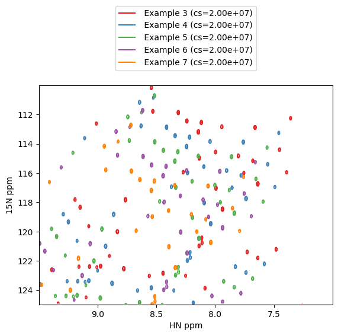

# Using pandas for NMR data

## Loading data

``` Python
from nmr_to_pandas import nmr_to_pandas
# load a pseudo 3D dataset. `pseudo_dim=0` sets the pseudo dimension assuming
# your data has shape (Z,Y,X) where Z is the pseudo dimension
data = nmr_to_pandas("test_pipe.ft2", pseudo_dim=0)
# your data object now has the attribute `df`
data.df.head()
```

You now have your NMR data in the form of a pandas dataframe where `Z` is the plane number and `Y` and `X` are points. The `intensity` column contains the intensity for each point and for convenience the X and Y ppm values are also provided (`X_PPM` and `Y_PPM`, respectively).

``` console
     Z    Y    X     intensity       Y_PPM      X_PPM
0  0.0  0.0  0.0 -24273.875000  130.538386  10.498205
1  0.0  0.0  1.0 -33351.800781  130.538386  10.490872
2  0.0  0.0  2.0  -9466.987305  130.538386  10.483539
3  0.0  0.0  3.0  -1997.709473  130.538386  10.476206
4  0.0  0.0  4.0  10106.075195  130.538386  10.468873
```

To slice out data you can use the `pandas.Dataframe.query` method.

``` Python
data.df.query("Z==1 & Y_PPM < 120 and X_PPM < 9")
```

``` console
          Z      Y      X     intensity       Y_PPM     X_PPM
201679  1.0  113.0  205.0  32269.908203  119.945665  8.994906
201680  1.0  113.0  206.0  73720.929688  119.945665  8.987572
201681  1.0  113.0  207.0 -35410.578125  119.945665  8.980239
201682  1.0  113.0  208.0    715.999634  119.945665  8.972906
201683  1.0  113.0  209.0  37729.289062  119.945665  8.965573
```

## Plotting

To create a matplotlib contour plot of the data:

``` Python
kwargs=dict(colors="red", negative_contours=dict(colors="orange"))
# create figure
fig = plt.figure()
ax = fig.add_subplot(111)
# contour plot of first plane (Z==0) 
ax = data.plot_contour(ax, query=f"Z==0", kwargs=kwargs, show_cs=True, invert_axes=True)
```


To zoom on a specific region:

``` Python
kwargs=dict(colors="tab:blue", negative_contours=dict(colors="orange"))
query = "Z==1 & X_PPM > 7.24 & X_PPM < 7.28 & Y_PPM > 124.8 & Y_PPM < 125.3"
fig = plt.figure()
ax = fig.add_subplot(111)
ax = data.plot_contour(ax, query=query, kwargs=kwargs, threshold=1e7, show_cs=True, invert_axes=True)
plt.grid()
```


Here is an example of how you might overlay some spectra for comparison (I'm just shifting and overlaying the same spectrum for illustrative purposes):

``` Python
colors = plt.cm.get_cmap("Set1")
colors = iter([colors(i) for i in range(20)])
fig = plt.figure()
ax = fig.add_subplot(111)
for i in range(3):
    data.name = f" Example {i+3}"
    kwargs=dict(colors=[next(colors)], negative_contours=dict(colors="red"))
    ax = data.plot_contour(ax, query=f"Z==0 & X_PPM > 7 & X_PPM < 9.5 & Y_PPM > 110 & Y_PPM < 125", kwargs=kwargs, show_cs=True)
    data.df["Y_PPM"] = data.df.Y_PPM + 1.0
    data.df["X_PPM"] = data.df.X_PPM + 0.1
ax.invert_yaxis()
ax.invert_xaxis()
```



## Customizing plots

### Colors
Any matplotlib colormap can be used in the following way by providing its name as a string:

``` Python
kwargs=dict(cmap="viridis", negative_contours=dict(colors="red"))
```
!!! note
    If `colors` is provided then this takes precedence over any `cmap` definition.
    e.g. if `kwargs=dict(cmap="viridis", colors="red")` then contours will be drawn `red` and `viridis` will be ignored. 

### Legends

If the `name` attribute of your `nmrData` object is populated with a string then this will be used to create a legend for your contour plot.

``` Python
data = nmr_to_pandas("test_pipe.ft2", pseudo_dim=0)
data.name = "Example 1"
```

If `show_cs=True` then the value of the contour start (cs) or `threshold` value is shown in the legend.

``` Python 
data.plot_contour(ax, query="Z==0", kwargs=kwargs, threshold=1e7, show_cs=True, invert_axes=True)
```

!!! note
    Legends are only available for contour plots using `colors` and not `cmaps`. 